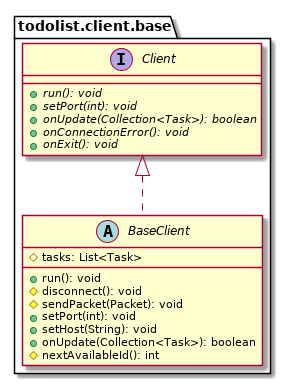

Rapport du projet : TodoList
============================

**Groupe *30***

Notre groupe est constitué de 3 personnes :

-   Melvin Campos Casares (***@melvinmajor***)
-   Maxime Liber (***@LiberTMx***)
-   Hubert Van De Walle (***@HE201496***)

GitHub
------

**Lien du repository :** <https://github.com/melvinmajor/TodoList>

**Lien du Wiki :** <https://github.com/melvinmajor/TodoList/wiki>

Cahier des charges - descriptif
-------------------------------

### *Quel est notre projet ?*

Notre projet est une liste de tâches à faire.

L'intérêt de réaliser ce projet est qu'il peut être utilisé au quotidien
pour divers tâches/choses dans divers domaines : les cours, les projets
personnels comme professionnels, etc.

Cette première analyse nous à par ailleurs donné l'idée d'implémenter
des catégories non spécifiées afin de laisser l'utilisateur de les
créer.

Comme demandé, ce projet fonctionnera sous le modèle MVC. Nous aurons un
affichage console et un affichage graphique qui sera "user-friendly".
Nous travaillerons également sous l'aspect client-serveur-socket.
L'interface graphique sera écrite sous JavaFX ou Swing.

Notre contrainte est que la todolist devra fonctionner sous Java 10 au
lieu de Java 8 (celui vu au cours pratique) et que nous créerons des
tests unitaires JUnit 5.

### Ce que notre projet doit absolument faire

La première chose qu'il doit pouvoir faire est de créer de nouvelles
tâches, de pouvoir les compléter ainsi que de les supprimer. En d'autres
termes, il faut qu'il puisse gérer les différentes tâches et les
enregistrer localement.

### Ce que notre projet serait capable de faire

-   Une partie du contenu des tâches pourra être modifié par la suite
    par l'utilisateur (tout sauf la date de création),
-   Trier par importance, date, etc.
-   Filtrer par utilisateur, catégorie ou période spécifique de temps.

### Quelques idées d'implémentations

Parce que nous souhaitons avoir quelque chose de réellement complet,
nous pourrions implémenter certaines des idées suivantes :

-   Une nouvelle variable qui stockera s'il s'agit d'un travail de
    groupe ou non,
-   D'autres options de tri ou filtre,
-   Une barre de progression pour des éléments précis comme la date
    d'échéance ou l'importance,
-   Une API JSON pour l'intégration du programme dans diverses
    applications par la suite (site internet, etc.).

Diagramme UML
-------------

Notre projet fonctionne sous l'aspect client-serveur.

Nous disposons de 2 clients :

-   un client CLI
-   un client GUI

\pagebreak

\pagebreak

\pagebreak

\pagebreak

\pagebreak

\pagebreak

\pagebreak

\pagebreak

\pagebreak

\pagebreak

\pagebreak

\pagebreak

\pagebreak

\pagebreak

Choix d'implémentation effectués
--------------------------------

### Interface graphique redimensionnable

Nous avons considéré cela comme secondaire et n'y avons prêté attention
que lorsque notre affichage principal était terminé et que nous nous
occupions de l'intégration des options permettant la gestion des tâches
directement via l'interface graphique.

Cela a entrainé un changement au niveau de l'aspect général de
l'interface graphique étant donné les contraintes liées au Grid Bag
Layout, le seul layout compatible avec notre idée d'affichage après
plusieurs essais infructueux avec d'autres options.

En utilisant le Grid Bag Layout, nous avons dû réadapter nos boutons en
haut de la fenêtre principale pour qu'ils soient intégrés dans un menu
horizontal.

### Intégration d'une librairie permettant d'utiliser des couleurs dans le terminal

Afin de rendre le client CLI plus agréable à utiliser, nous avons décidé
d'utiliser des couleurs dans celui-ci.

Les systèmes d'exploitation modernes supportent nativement les codes
d'escape ANSI. Quant à Windows, il ne permet d'utiliser des couleurs que
via l'accès d'un API natif.

Heureusement, la librairie ***Jansi*** nous a permis de résoudre le
problème. Elle utilise le framework JNI ou Java Native Interface pour
accéder au code natif.

Par exemple, le tableau listant toutes les tâches affiche des couleurs
spécifiques en fonction de la durée avant la date d'échéance et la
condition si complétée ou non.

### Création d'un API JSON

Le serveur peut être lancé avec comme option, la possibilité d'activer un serveur
HTTP. Celui offre une liste des tâches en JSON permettant ainsi d'être intégré
dans d'autres programmes qui ne nécéssitent pas d'utiliser Java.

Difficultés rencontrées
-----------------------

### Utilisation de 2 IDE différents avec **Maven**

Hubert a utilisé [IntelliJ IDEA Community
Edition](https://www.jetbrains.com/idea/) , un IDE très performant et
considéré par beaucoup comme supérieur à
[Eclipse](https://www.eclipse.org).

Melvin et Maxime ont quant à eux choisi de rester sur Eclipse pour la
familiarité avec ce qui est utilisé en cours de "Développement
informatique avancé orienté Applications".

Nous avons utilisé [*"Maven"*](https://maven.apache.org/) comme outil de
gestion de projet.

Pour ceux d'entre nous utilisant Eclipse, Il ne fut pas rare de devoir
reconstruire notre workspace (lors de la création du serveur et puis de
l'interface graphique) ou de devoir effectuer un refresh du workspace à
la moindre synchronisation avec Git.

### Java 11

Sur Windows, l'utilisation d'une version plus récente de Java n'a pas
été chose facile. En effet, Oracle ayant changé les conditions
d'utilisations de Java, il nous a fallu suivre
[OpenJDK](https://openjdk.java.net/) (le code Open Source de Java y est
disponible) pour récupérer un Java Development Kit (JDK) de Java 10
pouvant être librement utilisé. Par la suite, nous avons adopté
[AdoptOpenJDK](https://adoptopenjdk.net/) à la sortie de Java 11 pour
plus de simplicité à l'installation des nouvelles versions.

### *JavaFX ou Swing ?*

Au départ, nous voulions créer l'interface graphique en JavaFX et non
Swing. Cette décision était prise étant donné les problèmes majeurs liés
aux DPI des écrans (Windows et Linux impacté contrairement à macOS),
entre autres choses.

Malheureusement, on a très vite remarqué un manque de temps crucial et
nous avons préféré utiliser Swing avec Window Builder comme point de
départ. Cela a occasionné un code très lourd et difficile à séparer, ce
qui nous a permis de comprendre l'intérêt minime des systèmes WYSIWYG
(What You See Is What You Get).

### Gestion du planning

Au niveau de la gestion du temps, cela n'a pas été notre point fort.
Nous pensions avoir suffisamment de temps au départ, mais c'était sans
compter le projet en langage C du cours d'OS ainsi que l'examen de réseau
en fin de quadrimestre.

Tout cela a entrainé une certaine inconsistance au niveau du planning et
une avancée ralentie de ce projet.

Pistes d'amélioration éventuelles
---------------------------------

### Localizer

Une détection de la langue de l'environnement dans lequel le programme
fonctionne pour automatiquement s'adapter en fonction de sa base de
données et à défaut, être disponible en français serait une amélioration
envisageable.

Il faudra réadapter une partie du programme pour que cela soit possible.

### Choix des filtres et des tris

Concernant la partie commande, il était prévu d'implémenter la
possibilité de filter et trier les tâches en fonction de certains
critères.

Cependant, la demande d'utilisation de socket nous a tournés vers une
utilisation interactive afin de ne pas avoir à effectué de nouvelles
connexions à chaque action et donner une impression de lenteur.

Contrairement à ce qui était prévu au début (choisir des tris et filtres
avec une série d'arguments en commande), la demande répétée de différents
choix aurait vite été ennuyeuse.

Afin de garder le client commande minimaliste, nous avons donc utilisé
un tri par défaut sur la date puis l'importance des tâches, sans
options.

Pour la partie graphique, nous avons utilisé la même approche, mais
uniquement par manque de temps.

Conclusion
----------

### Melvin Campos Casares

Personnellement, j'ai trouvé ce projet très instructif même si la
relation avec la matière vue en cours théorique et pratique n'était pas
toujours en corrélation avec nos besoins. En effet, il n'a pas été rare
d'être confronté à l'impossibilité d'implémenter certaines idées étant
donné le manque de pratique au cours pratique (code fourni par le prof,
à recopier sans pour autant avoir le temps de forcément suivre toutes
ces explications, mais seulement certaines), ou encore à la nécessité
des Threads quasiment au départ du projet alors qu'on ne les a vus au
cours théorique qu'à la fin du quadrimestre. Quelques recherches en
ligne ont été nécessaires également afin d'arriver à nos fins.

Je trouve que le suivi des professeurs était intéressant, mais j’aurai
préféré avoir un retour plus complet par rapport aux problèmes mis en
avant : UML non mis à jour ainsi que des problèmes quant au choix des
flèches UML et la mise en place des tests unitaires.

Le travail de groupe sur un projet permet de se fixer des objectifs
supplémentaires et de mener à bien des projets plus complexes.
L'inconvénient, par contre, est le souci de relecture du code des
autres. Il m'est arrivé à plusieurs reprises de ne pas comprendre
certains ajouts et/ou certaines modifications venant des autres membres
du groupe. Après une petite discussion tous ensemble, cela fut bien
souvent plus facile à comprendre.

J'aurais bien voulu travailler sur JavaFX, mais par manque de temps et
soucis de facilité vu ce que nous avions vu en cours, nous avons pris
l'optique de Swing. C'est dommage, car JavaFX corrige nativement
certaines problématiques de Swing question fonctionnement sur différents
appareils avec des types d'écrans fortement variés (résolution, DPI,
etc.) comme soulevé plus tôt dans ce rapport.

Malgré notre gestion du temps pas toujours idéale et les contraintes
auxquelles nous avons dû faire face, cela m'a beaucoup appris sur les
projets réalisés à plusieurs, la façon de s'organiser tous ensemble,
mais également au niveau de la communication entre nous afin de se
départager les tâches et travailler plus efficacement.

Pour finir, je ne connaissais pas bien Maxime avant de commencer ce
projet, mais je me suis rapidement bien entendu avec lui. Je connaissais
déjà très bien Hubert et savais qu'il avait quelques bases en Java
pouvant s'avérer fort pratique pour mener à bien ce projet. Il nous a
tous aidés à mieux comprendre certains aspects de ce langage de
programmation et il fut possible de travailler certains soirs ensemble
pour finaliser quelques implémentations.

### Maxime Liber

En ce qui me concerne, j'ai trouvé ce travail de groupe enrichissant
tant au niveau du langage de programmation utilisé, que je n'avais
jamais utilisé auparavant, qu'au niveau humain.

Concernant le langage de programmation, je n'avais jamais fait de Java
avant le début de l'année scolaire et la mise en place de ce projet m'a
permis de pratiquer certains aspects vus en classe. J'ai trouvé ce
langage assez différent des autres vis-à-vis des notions de packages,
classes, collections... choses que je n'avais jamais utilisées dans les
autres langages que je connaissais déjà. Même si nouveau, ceci n'a pas
été un frein lors de la réalisation, car, comme beaucoup d'autres
langages, beaucoup d'informations et de problèmes auxquels j'ai été
confronté ont été résolus via l'utilisation du web.

Mise à part le langage de programmation, j'ai découvert Git et Github.
J'en avais déjà entendu parler par le passé, mais ce projet m'a permis
d'en découvrir plus via la pratique et l'utilisation quotidienne de
ceux-ci. Ces plateformes de partage nous ont été fort utiles et je les
ai trouvé très pratiques, même si, dans certains cas elles peuvent être
assez complexes au niveau des branches, conflits...

Au niveau humain, cela a également été une découverte, car je ne
connaissais pas Hubert et que très peu Melvin avant que le groupe soit
créé. Nous sommes parvenus à nous entendre et à travailler ensemble.
Hubert m'a été fort utile durant toute la durée de ce projet, étant
donné qu'il connaissait déjà le langage.

En conclusion, la réalisation de ce projet m'a plu et m'a permis de
découvrir un nouveau langage. C'est un bon début même si je suis
conscient que j'ai encore beaucoup de choses à apprendre et assimiler.

### Hubert Van De Walle

Pour ma part, j'ai apprécié ce projet, autant au niveau technique que
personnel malgré quelques difficultés.

Je connaissais déjà Java depuis quelques années, mais aux environs de la sortie
de Java 8, j'ai préféré utiliser Kotlin comme langage de programmation sur la
JVM. En utilisant Java 11, j'ai pu redécouvrir Java ainsi que ses nouveautés.
Ça ne reste clairement pas mon langage préféré mais il reste relativement
agréable à utiliser. J'ai également pu découvrir Maven, bien plus agréable que
Gradle selon moi.

Ce projet m'a également permis d'apprendre git plus en profondeur, ne l'ayant
utilisé qu'en solo auparavent.

L'entente était très bonne dans notre groupe. On a pu s'entraider quand il
le fallait.

## En conclusion

En conclusion, la réalisation de notre projet s'est globalement bien déroulée, nous avons atteint la plupart des objectifs fixés au départ. Et certains de ceux-ci ont été adaptés afin de régler certains problèmes. Nous avons implémenté certaines idées que nous pensions être des pistes d'améliorations éventuelles (API JSON, etc.).

Pour mettre à bien ce projet, nous avons su unir nos compétences et l'entente commune fut idéale. Nous avons su trouver des plages horaires convenant à tous, malgré nos emplois du temps chargé tant aux cours qu'en dehors.
